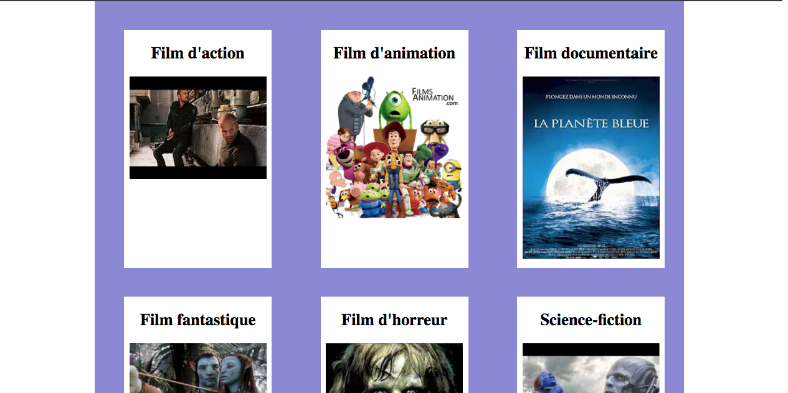
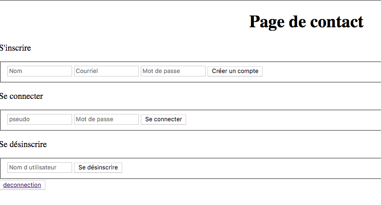
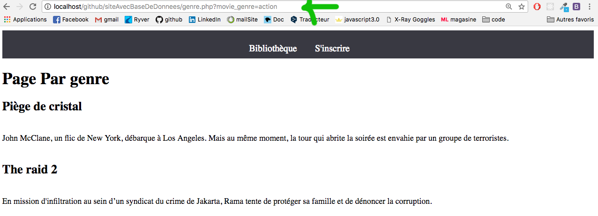

# Php AlloFilm site de résumé de films avec connection à la db + inscription + sessions

Les données se trouvent dans une base de données. Le genre, le titre, un résumé.

Une page ou l'on peut choisir son film par genre (les films sont dans une base de donnée):



Une page ou l'on peut s'inscrire, se connecter, se désinscrire, se déconnecter :



## Ajout de la base donnée

- La base de données est incluse. Il s'agit du fichier .sql
  - Créez une db alloFilms
  - Allez sur import pour ajouter le fichier .sql pour rajouter les tables

## Les différentes pages

### Le header

Mettre la session :

```PHP
<?php
if (isset($_SESSION['user_id']) AND isset($_SESSION['user_username']))
{
    echo 'Bonjour ' . $_SESSION['user_username'];
}
?>
```

### La page bibliothèque

 Celle où vous pourrez choisir un genre de film.


Imaginons que je clique sur le style action je serai redirigée vers la page genre.

`<a href="genre.php?movie_genre=action">`

page.php?variable=valeur

### la page genre 

La page sur laquelle vous êtes redirigé quand vous choisissez un genre de film. Elle aussi qui communique avec la base de donnée.



### la page inscription


- inclure le fichier request.php `<?php include "core/request.php"; ?>`
- 3 bouttons :un pour l'ajout, un pour supprimer et un qui verifie si l'utilisateur existe dans la db.
- les formulaires sont traités par la page request.php

## Traiter les formulaires, se connecter à la db, requêtes

### Le fichier config.php

La carte d'identité de la db. Contient les information la db. Le mot de passe, le nom de la base de donnée etc..

! Je suis sur mac. Changez le password si vous êtes sous pc ou sous linux.

### Le fichier connect.php

Fichier qui se connecte à la db

- Inclure le fichier config.php

### Le fichier request.php

Les requêtes SQL (delete, add etc...)

- Inclure le fichier connect.php
- N'oubliez pas de hacher le mot de passe

## Le fichier avec le formulaire d'inscription

- inscription.php

Inclure le fichier de request : `<?php include "core/request.php"; ?>` . Comme on l'a inclu, l'action du formulaire se fait au même endroit et donc l'action="" est vide.

Il y a 3 formulaires :
  - Pour s'inscrire
  - Pour se désinscrire
  - Pour se connecter(déjà inscrit)
